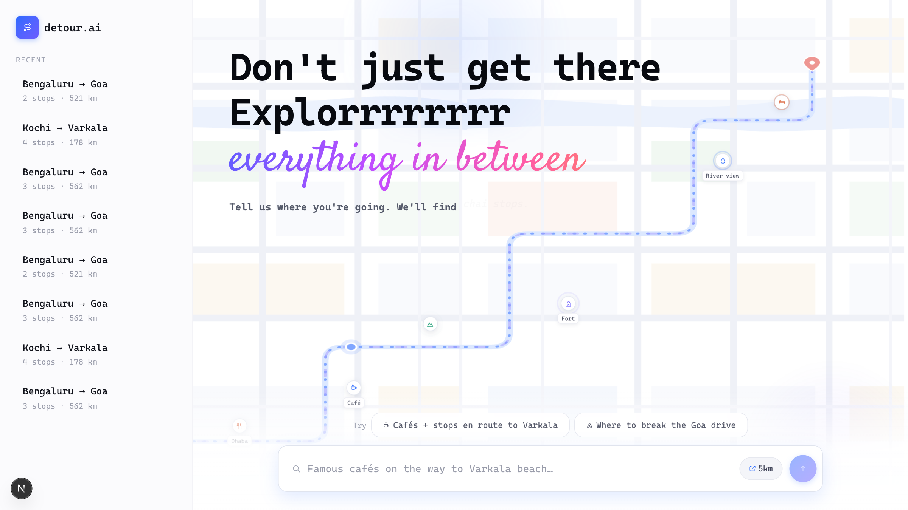
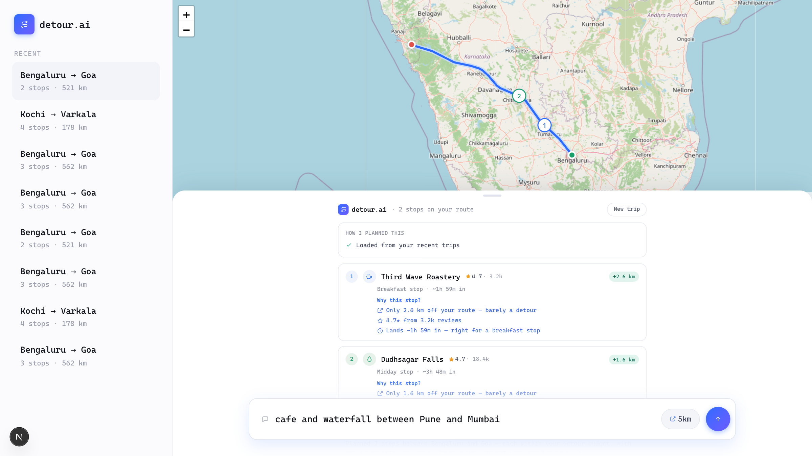
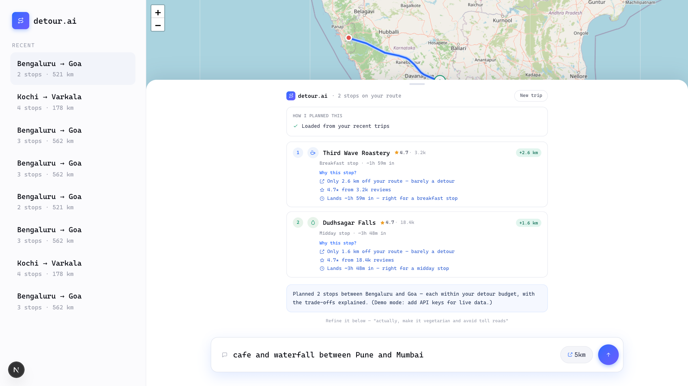

# detour.ai

> Tell it where you're driving in plain English — an AI agent finds the cafés, waterfalls, dhabas and stays worth pulling over for *along the way*, and explains why it picked each one.



<br />

## Why I built this

Every road trip I've done — Bangalore → Goa, Kochi → Varkala — the best parts were never the destination. They were the random dhaba, the waterfall 3 km off the highway, the viewpoint nobody told us about. But planning those stops means juggling 6 Google Maps searches and comparing everything manually.

Also, I wanted to learn **agentic AI** properly — not "call an LLM and print the answer", but an agent that plans, calls tools, reasons about trade-offs and explains itself. This felt like the perfect excuse to do both.

## What it does

You type one sentence:

> _"Driving Bangalore to Goa. I want a pet-friendly café for breakfast, one waterfall that's not crowded, and a hotel near the destination under 4k."_

The agent takes it from there:

✔️ Parses the intent and splits your route into legs (breakfast early, waterfall midday, hotel near the end)

✔️ Fires parallel searches along the actual highway polyline — sampled every ~20 km

✔️ Respects your **detour budget** — you say 5 km, it searches up to 2× and marks the far ones as "stretch" picks

✔️ Streams its reasoning live (`How I planned this`) while it works

✔️ Explains every pick — the **"Why this stop?"** card: detour cost, rating, and why it fits _your_ ask

✔️ Refines without restarting — _"actually make it vegetarian, avoid tolls"_ re-plans only what changed

✔️ Remembers your trips — saved to Postgres, one click in the sidebar reloads the full plan instantly (no agent re-run, no API cost)

## 🧠 How the agent works

The LLM is the brain, not a wrapper. It gets 4 typed tools and decides the order itself:

```
getRoute → splitIntoLegs → searchAlongRoute (×N, parallel) → finalizeStops
```

Everything streams over a GraphQL subscription (SSE) — every tool call becomes a live step in the UI. No API keys? A scripted demo agent drives the same tools with mock data, so the whole app runs on a fresh clone with zero setup.

## 🛠️ Tech used

| Layer | Tech |
| --- | --- |
| Agent | Vercel AI SDK + Gemini (swaps to Claude with one env var) |
| Maps data | Google Routes API, Places API (New), Geocoding |
| Backend | NestJS + GraphQL Yoga (subscriptions over SSE) |
| Frontend | Next.js 15, React Query, Zustand, Tailwind |
| Live map | Leaflet + OpenStreetMap (free, no key) |
| Data | PostgreSQL (TypeORM) for saved trips, Redis for API caching |
| Repo | pnpm + Turborepo monorepo, Docker Compose |

## Snips

**The agent's plan — streamed reasoning + real route on a real map**



**"Why this stop?" — every recommendation defends itself**



## ⚙️ Running locally

```bash
docker compose up -d postgres redis   # infra
pnpm install
pnpm dev                              # web :3000 · api :4000/graphql
```

Works with **zero API keys** (demo mode). For the real thing, drop into `apps/api/.env`:

```
GOOGLE_MAPS_API_KEY=...   # Routes + Places (New) + Geocoding enabled
GEMINI_API_KEY=...        # free at aistudio.google.com
```

## Future aspects

- Deploy a public demo (Vercel + Railway)
- pgvector memory — "find me places like that dhaba I loved last trip"
- Place photos + share links for finished plans
- True detour minutes via Directions waypoints instead of straight-line distance
